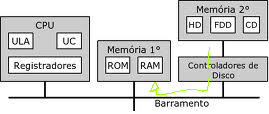

<h1>Jack_Sparrow_Tunado</h1>

 

<h2>O PROBLEMA</h2>

Neste projeto deve se encontrar resolução para a seguinte situação: Um garoto está perdido em um labirinto, ande de forma aleatória pelas casas de matrizes(estas representam o labirinto) com um garoto até consumir tudo que é possível, ou até que ele morra tentando pegar tudo, não importa se no resultado final o garoto sobreviveu ou não.

<h2>LÓGICA UTILIZADA</h2>

Para preencher os arquivos foi utilizado o <a href="https://github.com/mpiress/GenerateDataToMaze">algoritimo</a> desenvolvido por Michel Pires, que esta em seu perfil do git hub.  

As matrizes foram gravadas em arquivos distintos, para que fosse possível extrair uma matriz de cada vez, e colocar apenas uma na mémoria RAM para ser trabalhada.

A RAM opera em velocidades muito mais altas em comparação com HDDs ou SSDs, pois está diretamente conectada à CPU (Central Processing Unit) do computador e fornece acesso rápido aos dados que a CPU precisa para executar tarefas. Isso permite que a CPU recupere e armazene rapidamente dados de e para a RAM, o que ajuda a acelerar o desempenho geral de um computador.

Porem ela é limitada, e lembrando que existem diversos outros processos sendo executados na CPU e armazenados na RAM, sendo assim para ganhar eficiência neste projeto em qualquer computador é inteligente trabalhar com os dados de uma matriz de cada vez. 

Alem disso para que o programa se tornasse um pouco mais leve em todo o código e para que fosse possível manipular os mesmos dados em diferentes arquivos, foi utilizado um ponteiro para acessar a posição de memória onde a struct da matriz estava, visto que essa matriz é acessada em varios pontos do código e em varios arquivos.

O ponteiro é uma variável que aponta a uma posição de memória, enquanto um objeto é uma variável que armazena uma posição e o conteúdo armazenado nessa variável, mostrando se mais caro computacionalmente.

<h2>REFERÊNCIAS</h2>

<ul>
    <li>ChatGPT.
    <li>Algoritmos: Teoria e Prática, Pag: 7 e 8.
</ul>