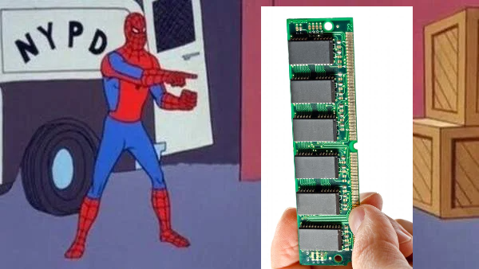
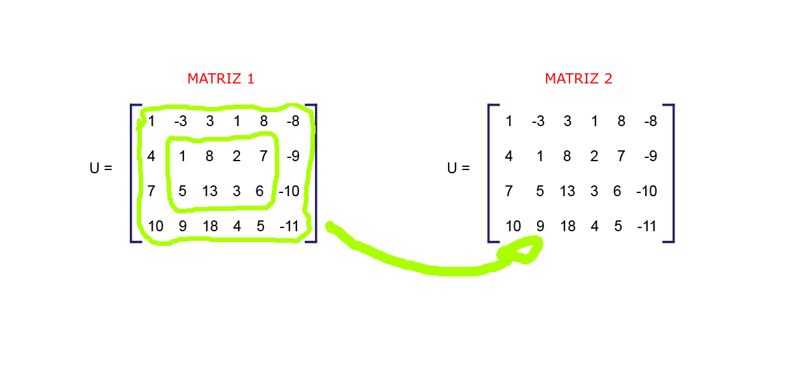
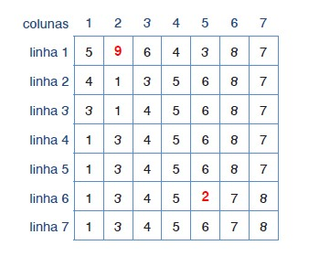
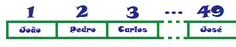
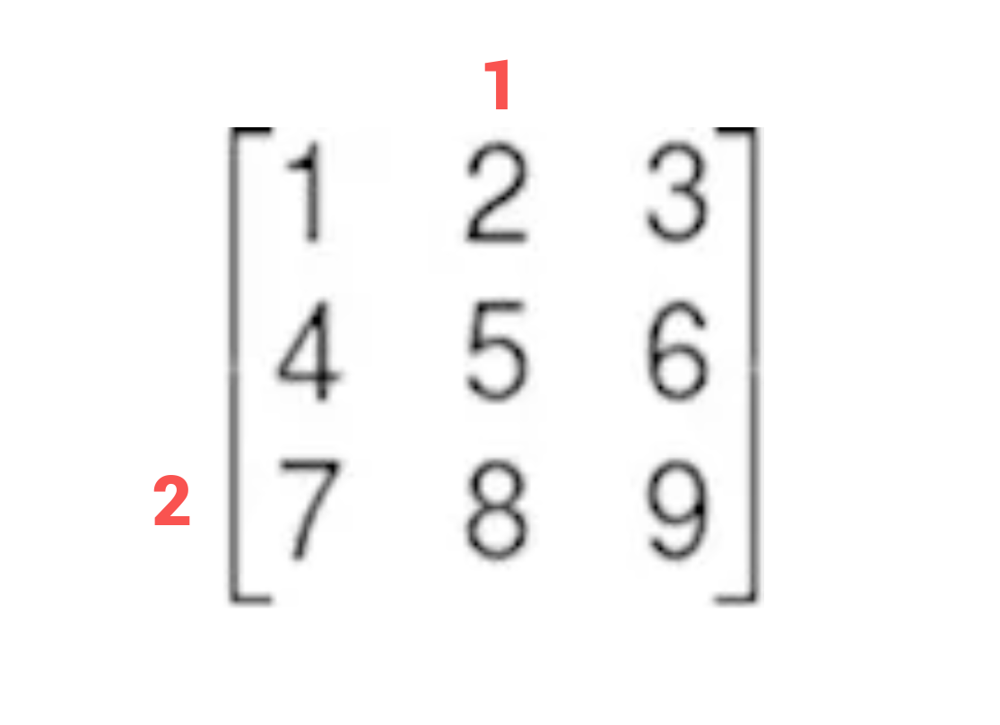

<h1>Jack_Sparrow_Tunado</h1>

 

<h2>O PROBLEMA</h2>

Neste projeto deve se encontrar resolução para a seguinte situação: Um garoto está perdido em um labirinto, ande de forma aleatória pelas casas de matrizes(estas representam o labirinto) com um garoto até consumir tudo que é possível, ou até que ele morra tentando pegar tudo, não importa se no resultado final o garoto sobreviveu ou não.

<h2>LÓGICA UTILIZADA</h2>

Para resolver o problema foi necessário trazer soluções para os seguintes problemas:

<ul>
    <li>Como trabalhar os dados de entrada, sendo eles um grande número de matrizes e de ordem muito grande?
    <li>Como andar pelas matrizes de maneira aleatória, e ao mesmo tempo contar as casas percorridas, alem da quantidade de elementos coletados pelo percurso ?
    <li>Como saber ao final do programa quais casas não foram acessadas?.
</ul>

Para preencher os arquivos foi utilizado o <a href="https://github.com/mpiress/GenerateDataToMaze">algoritimo</a> desenvolvido por Michel Pires, que esta em seu perfil do git hub.  

Se faz necessário abrir o arquivo, ler e operar matriz por matriz, mas e se houver uma quantidade de matrizes tão grande que não seja possível comportar a quantidade de dados na memória RAM de uma só vez, o que fazer diante disso?

As matrizes foram gravadas em arquivos distintos, para que fosse possível extrair uma matriz de cada vez, e colocar apenas uma na mémoria RAM para ser trabalhada.

A RAM opera em velocidades muito mais altas em comparação com HDDs ou SSDs, pois está diretamente conectada à CPU (Central Processing Unit) do computador e fornece acesso rápido aos dados que a CPU precisa para executar tarefas. Isso permite que a CPU recupere e armazene rapidamente dados de e para a RAM, o que ajuda a acelerar o desempenho geral de um computador.

Porem ela é limitada, e lembrando que existem diversos outros processos sendo executados na CPU e armazenados na RAM, sendo assim para ganhar eficiência neste projeto em qualquer computador é inteligente trabalhar com os dados de uma matriz de cada vez., assim otimizando espaço. 

Agora o que tem de ser feito para conseguir trabalhar a matriz e altera-la do estado original quando foi inserida no programa, alcançando a morte de Jack ou zerando todas as matrizes ?

Para realizar tal procedimento e para que o programa se tornasse um pouco mais leve em todo o código e ainda fosse possível manipular os mesmos dados em diferentes arquivos, a matriz utilizada foi passada como referência para as funções que fosse necessário realizar alguma operação com a mesma, visto que essa matriz é acessada em vários pontos do código e em varios arquivos.

O ponteiro é uma variável que aponta a uma posição de memória, enquanto uma variável armazena uma posição e o conteúdo armazenado nessa variável, mostrando se mais caro computacionalmente, isso é dito pois a refencia passada da matriz nesse projeto se trata de um ponteiro.

Resolvido a forma de manter os dados em uma estrutura que permitisse desenvolve-los, surge a questão: como caminhar pela matriz de maneira a decidir os passos de forma aleatória?.

Para caminhar pela matriz foi utilizado um processo de escolha aleatória e imparcial nativo da linguage C, a qual pode ser chamada utilizando a seguinte expressão "srand()", que se trata de um gerador de números, uma função interna dos arquivos da linguagem, que executa o procedimento de gerar números aleatórios de acordo com uma semente fornecida.

Inicialmente foi utilizado o srand com a semente "time(0)", o qual recupera o tempo atual em segundos desde a época de 1º de janeiro de 1970 e é usado como valor inicial, com o intervalo de 0 a 1 e uma segunda decisão aleatória era tomada para decidir se o 1 seria negativo ou não, porem essa estratégia se mostrou pouco eficiente. 

Em uma segunda abordagem resolvi utilizar uma estratégia similar a utilizada por Michel pires em seu <a href="https://github.com/mpiress/GenerateDataToMaze">algoritmo de geração aleatória de matrizes</a>, onde ele usa um intervalo maior para decidir entre três opções de elementos para compor uma casa de uma matrix, mas o que trouxe para esse projeto foi a ideia de ter um intervalo maior, dando um campo de escolha maior para que se tornassem maiores as possibilidades de cair em 1, 0 ou -1, o pseudocódigo a seguir mostra isso:

Escolha aleatória para caminhamento em uma matrix 
1&nbsp;&nbsp;&nbsp;&nbsp;&nbsp;&nbsp;&nbsp;&nbsp;IF&nbsp;&nbsp;parameter&nbsp;&nbsp;==&nbsp;&nbsp;true&nbsp;&nbsp;THEN 
2&nbsp;&nbsp;&nbsp;&nbsp;&nbsp;&nbsp;&nbsp;&nbsp;&nbsp;&nbsp;&nbsp;&nbsp;&nbsp;&nbsp;number_Colunm&nbsp;&nbsp;=&nbsp;&nbsp;RANDOM(0,6) 
3&nbsp;&nbsp;&nbsp;&nbsp;&nbsp;&nbsp;&nbsp;&nbsp;&nbsp;&nbsp;&nbsp;&nbsp;&nbsp;&nbsp;number_Row&nbsp;&nbsp;=&nbsp;&nbsp;RANDOM(0,6) 
4&nbsp;&nbsp;&nbsp;&nbsp;&nbsp;&nbsp;&nbsp;&nbsp;ELSE 
5&nbsp;&nbsp;&nbsp;&nbsp;&nbsp;&nbsp;&nbsp;&nbsp;&nbsp;&nbsp;&nbsp;&nbsp;&nbsp;&nbsp;choosen&nbsp;&nbsp;=&nbsp;&nbsp;RANDOM(0,19) 
6&nbsp;&nbsp;&nbsp;&nbsp;&nbsp;&nbsp;&nbsp;&nbsp;&nbsp;&nbsp;&nbsp;&nbsp;&nbsp;&nbsp;IF choosen&nbsp;&nbsp;>&nbsp;&nbsp;5&nbsp;&nbsp;AND&nbsp;&nbsp;choosen&nbsp;&nbsp;<&nbsp;&nbsp;12&nbsp;&nbsp;THEN 
7&nbsp;&nbsp;&nbsp;&nbsp;&nbsp;&nbsp;&nbsp;&nbsp;&nbsp;&nbsp;&nbsp;&nbsp;&nbsp;&nbsp;&nbsp;&nbsp;&nbsp;&nbsp;&nbsp;&nbsp;number_Colunm = 1 
8&nbsp;&nbsp;&nbsp;&nbsp;&nbsp;&nbsp;&nbsp;&nbsp;&nbsp;&nbsp;&nbsp;&nbsp;&nbsp;&nbsp;ELSE&nbsp;&nbsp;IF&nbsp;&nbsp;choosen&nbsp;&nbsp;>&nbsp;&nbsp;0&nbsp;&nbsp;AND&nbsp;&nbsp;choosen&nbsp;&nbsp;<&nbsp;&nbsp;6&nbsp;&nbsp;THEN 
9&nbsp;&nbsp;&nbsp;&nbsp;&nbsp;&nbsp;&nbsp;&nbsp;&nbsp;&nbsp;&nbsp;&nbsp;&nbsp;&nbsp;&nbsp;&nbsp;&nbsp;&nbsp;&nbsp;&nbsp;number_Colunm&nbsp;&nbsp;=&nbsp;&nbsp;-1 
10&nbsp;&nbsp;&nbsp;&nbsp;&nbsp;&nbsp;&nbsp;&nbsp;&nbsp;&nbsp;&nbsp;&nbsp;ELSE 
11&nbsp;&nbsp;&nbsp;&nbsp;&nbsp;&nbsp;&nbsp;&nbsp;&nbsp;&nbsp;&nbsp;&nbsp;&nbsp;&nbsp;&nbsp;&nbsp;&nbsp;&nbsp;number_Colunm&nbsp;&nbsp;=&nbsp;&nbsp;0 
12&nbsp;&nbsp;&nbsp;&nbsp;&nbsp;&nbsp;&nbsp;&nbsp;&nbsp;&nbsp;&nbsp;&nbsp;choosen&nbsp;&nbsp;=&nbsp;&nbsp;RANDOM(0,19) 
13&nbsp;&nbsp;&nbsp;&nbsp;&nbsp;&nbsp;&nbsp;&nbsp;&nbsp;&nbsp;&nbsp;&nbsp;IF choosen&nbsp;&nbsp;>&nbsp;&nbsp;5&nbsp;&nbsp;AND&nbsp;&nbsp;choosen&nbsp;&nbsp;<&nbsp;&nbsp;12&nbsp;&nbsp;THEN 
14&nbsp;&nbsp;&nbsp;&nbsp;&nbsp;&nbsp;&nbsp;&nbsp;&nbsp;&nbsp;&nbsp;&nbsp;&nbsp;&nbsp;&nbsp;&nbsp;&nbsp;&nbsp;number_Row&nbsp;&nbsp;=&nbsp;&nbsp;1 
15&nbsp;&nbsp;&nbsp;&nbsp;&nbsp;&nbsp;&nbsp;&nbsp;&nbsp;&nbsp;&nbsp;&nbsp;ELSE&nbsp;&nbsp;IF&nbsp;&nbsp;choosen&nbsp;&nbsp;>&nbsp;&nbsp;0&nbsp;&nbsp;AND&nbsp;&nbsp;choosen&nbsp;&nbsp;<&nbsp;&nbsp;6&nbsp;&nbsp;THEN 
16&nbsp;&nbsp;&nbsp;&nbsp;&nbsp;&nbsp;&nbsp;&nbsp;&nbsp;&nbsp;&nbsp;&nbsp;&nbsp;&nbsp;&nbsp;&nbsp;&nbsp;&nbsp;number_Row&nbsp;&nbsp;=&nbsp;&nbsp;-1 
17&nbsp;&nbsp;&nbsp;&nbsp;&nbsp;&nbsp;&nbsp;&nbsp;&nbsp;&nbsp;&nbsp;&nbsp;ELSE 
18&nbsp;&nbsp;&nbsp;&nbsp;&nbsp;&nbsp;&nbsp;&nbsp;&nbsp;&nbsp;&nbsp;&nbsp;&nbsp;&nbsp;&nbsp;&nbsp;&nbsp;&nbsp;number_Row&nbsp;&nbsp;=&nbsp;&nbsp;0 
19&nbsp;&nbsp;&nbsp;&nbsp;&nbsp;&nbsp;END&nbsp;&nbsp;IF 

O primeiro if demonstra uma regra que foi estabelecida para que Jack conseguisse percorrer todas as matrizes sem ficar preso a necessidade de ter de zerar a corrente matriz onde ele está, então a regra é: quando ele chega as extremidades de uma matriz ele é teletransportado para outra matriz do arquivo de entrada, e uma posição da matriz é escolhida de forma aleatória.Como mostra a imagem:

Determinado a forma de caminhamento pela matriz foi necessário saber por onde Jack não estava passando assim que o programa encerrasse, para tal conceituemos o seguinte, toda matriz tem linhas e colunas atreladas a uma de suas casas, e suas linhas e colunas estão em ordem crescente, como mostra a imagem:

Agora se enumerarmos em ordem crescente as casas da matriz, considerando-a quadratica, e seguindo o sentido das colunas variando de um a um, e pulando uma linha quando chegarmos no valor da ordem ao variar as colunas, e com isso retornar ao primeiro elemento da linha subsequente e prosseguir a contage até chegar a ultima casa da matriz, que fica na quina inferior direita, teremos a seguinte situação: cada casa vai ter uma posição em uma contagem em ordem crescente, e considerando uma ordem n, teremos o tamanho dessa contagem que é: n².

Se colocassemos todos os elementos da matriz um após o outro sem quebrarmos uma linha durante essa organização o que teriamos é um vetor de n² posições, supondo que seja uma matriz de ordem 7 temos:

Estas posições são os elementos da matriz e podem ser encontrados com a seguinte função de duas variaveis reais: Elemento = ((Linha x Ordem) + 1) + Coluna, mas observe que a fórmula esta declarada no contexto de indexação da computação, ou seja, o primeiro index de um vetor não será 1 e sim 0, agora imagine uma matriz de ordem 3 você quer descobrir um elemento cuja linha de localização é de valor 2, e coluna de valor 1, se você multiplicar o valor da linha pela ordem obterá o ultimo elemento da linha anterior, 2 x 3 = 6, se somarmos 1 a esse resultado obteremos o primeiro elemento da linha onde o elemento procurado esta, e somando ao valor da coluna teremos o elemento procurado, 2 x 3 + 1 + 1 = 8.

Agora tendo as posições extraidas a cada interação pela expressão matemática apresentada, e sendo salva na pasta Diferentvet, pode se tratar da maneira de como obter a quantidade de casas não passadas por Jack. Para tal ja que temos as posições por onde Jack passou basta obtermos a quantidade total de elementos menos a quantidade de casas onde ele passou, mas para que fosse desconsiderado as repetições as posições encontradas foram armazenadas em um vetor totalmente preenchido com zeros, onde são inseridos na posição respectiva ao seu valor, e a inserção neste vetor só ocorre se a casa do vetor estiver preenchida com zero, se não for o caso ele não entra no desvio condicional e conta o número de casas onde ele passou, supondo que o arquivo de entrada tenha 3 matrizes, e essas tenham ordem 4 o algoritmo seria:

Contagem de casas não visitadas: 
1&nbsp;&nbsp;&nbsp;&nbsp;&nbsp;&nbsp;&nbsp;&nbsp;FOR&nbsp;&nbsp;i&nbsp;&nbsp;=&nbsp;&nbsp;1&nbsp;&nbsp;TO&nbsp;&nbsp;16&nbsp;&nbsp;STEP 
2&nbsp;&nbsp;&nbsp;&nbsp;&nbsp;&nbsp;&nbsp;&nbsp;&nbsp;&nbsp;&nbsp;vet_check&nbsp;&nbsp;=&nbsp;&nbsp;0 
3&nbsp;&nbsp;&nbsp;&nbsp;&nbsp;&nbsp;&nbsp;&nbsp;END&nbsp;&nbsp;FOR 
4&nbsp;&nbsp;&nbsp;&nbsp;&nbsp;&nbsp;&nbsp;&nbsp;WHILE&nbsp;&nbsp;Counter&nbsp;&nbsp;<=&nbsp;&nbsp;3 
5&nbsp;&nbsp;&nbsp;&nbsp;&nbsp;&nbsp;&nbsp;&nbsp;&nbsp;&nbsp;&nbsp;Counter++ 
6&nbsp;&nbsp;&nbsp;&nbsp;&nbsp;&nbsp;&nbsp;&nbsp;&nbsp;&nbsp;&nbsp;SET&nbsp;&nbsp;file&nbsp;&nbsp;=&nbsp;&nbsp;OPEN("Diferentvet/output.data","r") 
7&nbsp;&nbsp;&nbsp;&nbsp;&nbsp;&nbsp;&nbsp;&nbsp;&nbsp;&nbsp;&nbsp;Cleararrey(name) 
8&nbsp;&nbsp;&nbsp;&nbsp;&nbsp;&nbsp;&nbsp;&nbsp;&nbsp;&nbsp;&nbsp;SET&nbsp;&nbsp;size&nbsp;&nbsp;=&nbsp;&nbsp;READ_INTERGER(file) 
9&nbsp;&nbsp;&nbsp;&nbsp;&nbsp;&nbsp;&nbsp;&nbsp;&nbsp;&nbsp;&nbsp;SET&nbsp;&nbsp;lixo&nbsp;&nbsp;=&nbsp;&nbsp;READ_INTERGER(file) 
10&nbsp;&nbsp;&nbsp;&nbsp;&nbsp;&nbsp;&nbsp;&nbsp;&nbsp;vet&nbsp;&nbsp;=&nbsp;&nbsp;ALLOCATE_MEMORY(sizeof(Interger)) 
11&nbsp;&nbsp;&nbsp;&nbsp;&nbsp;&nbsp;&nbsp;&nbsp;&nbsp;FOR&nbsp;&nbsp;i&nbsp;&nbsp;=&nbsp;&nbsp;1&nbsp;&nbsp;TO&nbsp;&nbsp;size&nbsp;&nbsp;STEP 
12&nbsp;&nbsp;&nbsp;&nbsp;&nbsp;&nbsp;&nbsp;&nbsp;&nbsp;&nbsp;&nbsp;SET&nbsp;&nbsp;vet[i]&nbsp;&nbsp;=&nbsp;&nbsp;READ_INTERGER(file) 
13&nbsp;&nbsp;&nbsp;&nbsp;&nbsp;&nbsp;&nbsp;&nbsp;&nbsp;END&nbsp;&nbsp;FOR 
14&nbsp;&nbsp;&nbsp;&nbsp;&nbsp;&nbsp;&nbsp;&nbsp;&nbsp;FOR&nbsp;&nbsp;i&nbsp;&nbsp;=&nbsp;&nbsp;1&nbsp;&nbsp;TO&nbsp;&nbsp;size&nbsp;&nbsp;STEP 
15&nbsp;&nbsp;&nbsp;&nbsp;&nbsp;&nbsp;&nbsp;&nbsp;&nbsp;&nbsp;&nbsp;index&nbsp;&nbsp;=&nbsp;&nbsp;vet[&nbsp;i&nbsp;] 
16&nbsp;&nbsp;&nbsp;&nbsp;&nbsp;&nbsp;&nbsp;&nbsp;&nbsp;&nbsp;&nbsp;IF&nbsp;&nbsp;vet_check[&nbsp;i&nbsp;]&nbsp;&nbsp;==&nbsp;&nbsp;0&nbsp;&nbsp;THEN 
17&nbsp;&nbsp;&nbsp;&nbsp;&nbsp;&nbsp;&nbsp;&nbsp;&nbsp;&nbsp;&nbsp;&nbsp;&nbsp;vet_check[index]&nbsp;&nbsp;=&nbsp;&nbsp;index 
18&nbsp;&nbsp;&nbsp;&nbsp;&nbsp;&nbsp;&nbsp;&nbsp;&nbsp;&nbsp;&nbsp;&nbsp;&nbsp;Counter_Walking++ 
19&nbsp;&nbsp;&nbsp;&nbsp;&nbsp;&nbsp;&nbsp;&nbsp;&nbsp;&nbsp;&nbsp;END&nbsp;&nbsp;IF 
20&nbsp;&nbsp;&nbsp;&nbsp;&nbsp;&nbsp;&nbsp;&nbsp;&nbsp;END&nbsp;&nbsp;FOR 
21&nbsp;&nbsp;&nbsp;&nbsp;&nbsp;&nbsp;&nbsp;&nbsp;&nbsp;FOR&nbsp;&nbsp;i&nbsp;&nbsp;=&nbsp;&nbsp;1&nbsp;&nbsp;TO&nbsp;&nbsp;16&nbsp;&nbsp;STEP 
22&nbsp;&nbsp;&nbsp;&nbsp;&nbsp;&nbsp;&nbsp;&nbsp;&nbsp;&nbsp;&nbsp;&nbsp;vet_check[&nbsp;i&nbsp;]&nbsp;&nbsp;=&nbsp;&nbsp;0 
23&nbsp;&nbsp;&nbsp;&nbsp;&nbsp;&nbsp;&nbsp;&nbsp;&nbsp;END&nbsp;&nbsp;FOR 
24&nbsp;&nbsp;&nbsp;&nbsp;&nbsp;&nbsp;&nbsp;&nbsp;&nbsp;QuantitiHouses&nbsp;&nbsp;=&nbsp;&nbsp;tamanho_vet&nbsp;&nbsp;-&nbsp;&nbsp;Counter_Walking 

<h2>EXEMPLO DE ENTRADA E SAÍDA</h2>

<h2>COMO COMPILAR ESSE PROJETO</h2>

Como mostra o gif, neste projeto é utilizado o arquivo de diretrizes de comando makefile, para compilar e executar este projeto basta digitar os seguintes comandos no terminal:

<ul>
    <li>make ou make all
    <li>make run
</ul>

o primeiro comando ao ser executado no terminal pede ao sistema operacional que procure um arquivos dentro da pasta do projeto chamado de Makefile, e assim que encontra como não houve mais nenhuma especificação após ser digitado make ele vai procurar por uma diretriz dentro deste arquivo chamada de all, e executará o comando redigido no campo desta diretriz, na mesma lógica temos o comando make run, porem este comando esta codificado para executar uma diretriz que fará a execução do executável gerado no processo de compilação. E ainda há uma outra diretriz cujo nome é: makeclean, que realiza a limpeza do executável.

<h2>CONCLUSÃO</h2>

Pode se concluir a partir de todas as informações aqui discorridas, e das soluções as problemáticas apontadas que representam a estruturação do código, que não se faz possível estipular um custo preciso a este algoritmo, visto que a forma de caminhamento pela matriz é indefinida, a cada interação não há como prever com exatidão o que vai acontecer, sendo assim é complexo elaborar um custo computacional, Segundo <a href = "https://pt.wikipedia.org/wiki/Nivio_Ziviani">Nivio Ziviane</a> a abordagem mais adequada para análise de algoritmos está relacionada a entrada, e análise das operações realizadas com esses dados, porem é muito usual desconsiderar operações aritméticas e considerar apenas laços de repetição e desvios condicionais, mas no cenário destre projeto não é possível dizer quantas vezes a entrada vai interagir nos laços de repetições ou quantas vezes a execução sofrerá um desvio condicional e executará outro bloco de código influenciando no tempo de execução.

<h2>REFERÊNCIAS</h2>

<ul>
    <li>TH.Cormen,Algoritmos: Teoria e Prática, MIT press,2009, Pag: 7 e 8.
    <li>N.Ziviane,Projeto de Algoritmos: com implementação em Java e C++,São Paulo,Thonson Learning,2007.
</ul>

<h2>AUTOR</h2>

Frank Leite Lemos Costa, aluno de Engenharia da Computação no <a href = "https://www.cefetmg.br/">CEFET</a>, 3° período.

&nbsp;&nbsp;&nbsp;&nbsp;&nbsp;&nbsp;&nbsp;&nbsp; &nbsp;&nbsp;&nbsp;linkedin&nbsp;&nbsp;&nbsp;&nbsp;&nbsp;&nbsp;&nbsp;&nbsp;&nbsp;&nbsp;&nbsp;&nbsp;&nbsp;&nbsp;&nbsp;(31) 99644-9587